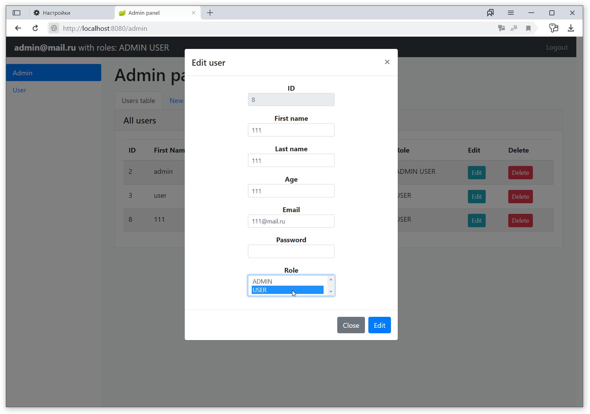

# Spring_Security


This is a CRUD (Create, Read, Update, Delete) application designed to manage data in a database. It allows you to create, read, update and delete users in the database through a convenient web interface.


## Requirements


To run this application, you will need the following:

Java Development Kit (JDK) version 8 or higher
Apache Maven to build the project
Compatible database (for example, PostgreSQL)
## Installation

1. Clone the project repository to your local machine:

```bash
git clone https://github.com/VeraSlaveholder/Spring_Security.git
```
2. Edit the 'application.properties' file to configure the connection to your database:

```bash
spring.datasource.url = jdbc:postgresql://localhost:5432/your_database_name
spring.datasource.username = your_username
spring.datasource.password = your_password
```
3. Build a project using Apache Maven:

```bash
mvn clean package
```
4. Launch the app
5. Open a web browser and go to http://localhost:8080 to access the Spring_Security application.
## Usage/Examples


CRUD app provides the following features:

Login: Enter your credentials, such as username and password, to log in. This will give you access to the main functions of the application.


Creating a user: You can create a new user by filling in the required fields of the web form and clicking the "Create" button.


View all users: You can view information about all users.


Viewing a specific user: You can view information about an existing user.


User Update: You can update the information about an existing user by changing the required fields and clicking the "Save" button.


Deleting a user: You can delete a certain user by selecting it from the list and clicking the "Delete" button.


## Contributing

If you want to contribute to the development of this project, write to us at the email address bulgakova.vera2003@gmail.com to discuss the possibilities of cooperation and making changes to the project. We welcome bug reports, suggestions for improvements, and new ideas for app functionality.

Thank you for your interest in the project and your contribution to its development!
## Authors

- [@VeraSlaveholder](https://github.com/VeraSlaveholder)

